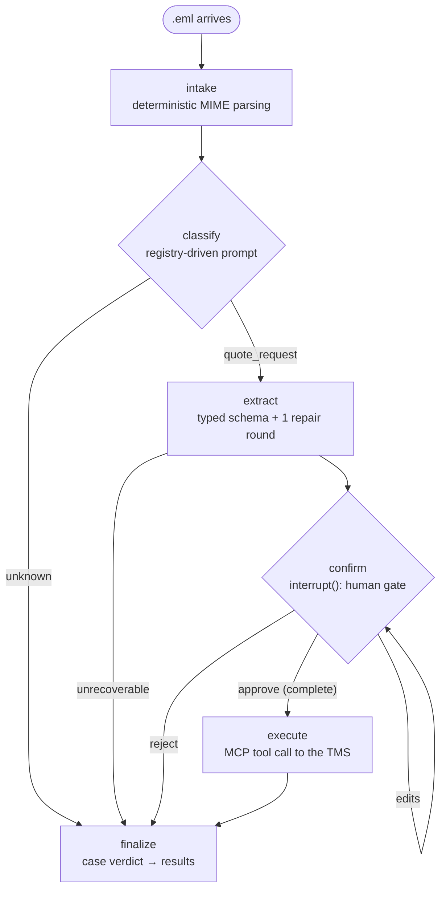

# Freightcase

**A case file for every freight email.** An extensible LangGraph agent that
sits on top of a logistics inbox: each incoming email opens a case — classified,
extracted against a typed schema, confirmed by a human, executed against the
adopter's own TMS via MCP — and every case ends with a verdict: executed,
rejected, or dead-lettered with the reason.

Portfolio project, deliberately scoped: one flow (quote requests) done
excellently over many flows done partially. The second flow (booking
instructions) is planned solely to prove the extension claim, not to grow
the feature list.

## How a case moves



The pause at **confirm** is durable — state checkpoints, the process can
exit, and the case resumes days later from a `Command(resume=...)`. The
human can approve, reject, or supply edits (validated like any other
untrusted input); approval requires completeness, and every re-prompt says
why. Whatever happens, the case lands in `results` with its full record:
extracted fields, per-field provenance (stated / normalized / missing /
edited), warnings, the TMS reference or the error.

## What to look at

The parts of this codebase that carry engineering weight:

- **Transcription vs interpretation** ([`specialists/common.py`](src/freightcase/specialists/common.py)) —
  the model transcribes what the email says ("toneladas"); deterministic
  validators normalize it, and per-field provenance survives all the way to
  the reviewer. The prompt schema deliberately avoids enums on transcribed
  fields because type constraints smuggle interpretation into the model.
- **A crash-proof HITL loop** ([`graph.py`](src/freightcase/graph.py) `confirm`) —
  LangGraph replays cached resume values on retry, so an exception on bad
  human input wedges a thread *permanently*. Every invalid answer becomes a
  re-prompt with the reason attached. Found the hard way; pinned by tests.
- **The specialist registry** ([`registry.py`](src/freightcase/registry.py)) —
  single source for what a function needs: description (builds the
  classifier prompt), schema (extraction dispatch + checkpoint rehydration),
  tool (what the human approves is what runs). Adding a specialist touches a
  schema subclass, one registry entry, one Literal — the pipeline, HITL
  machinery, and evals follow without edits.
- **Polymorphic state that survives checkpoints** ([`contracts.py`](src/freightcase/contracts.py)) —
  the case record's `output` is abstract-typed; the serde round-trips
  through dicts, so the envelope carries its own discriminator and the
  registry rehydrates the concrete schema on restore.
- **Staged, framework-free evals** ([`evals.py`](src/freightcase/evals.py)) —
  classification, extraction, and pipeline measured separately so failures
  attribute to the component that caused them; drop-in case folders so an
  adopter's production emails never leave their machine.

## Quickstart

Install [uv](https://docs.astral.sh/uv/) and [Ollama](https://ollama.com).
Pull the model before you start. The default model is `gemma4:31b`. To use
a different model, set `AGENT_MODEL` in `.env`.

```bash
uv sync                              # install dependencies
uv run pytest                        # run all 147 tests (~50s; some call the live model)
uv run langgraph dev                 # start LangGraph Studio
uv run python scripts/run_evals.py   # run the staged evals locally
```

In Studio, invoke the graph with an `eml_file_path`. The run stops at the
confirmation gate. Approve, edit, or reject the case. On approval, the MCP
write goes to the stub TMS.

[`tms_stub.py`](src/freightcase/tms_stub.py) is the demo TMS. It is a real
MCP server that keeps quotes in memory. Studio runs use the full MCP path:
client, transport, tool. To connect a real TMS, change one constructor
argument.

## Layout

| Module | Role |
| --- | --- |
| [`graph.py`](src/freightcase/graph.py) | State, nodes, wiring; nodes are thin wrappers over plain functions |
| [`specialists/`](src/freightcase/specialists/) | `base.py` (the SpecialistSchema ABC), `common.py` (shared freight vocabulary), `quote.py` (the first specialist) |
| [`registry.py`](src/freightcase/registry.py) | Function → description / subgraph / tool / schema |
| [`contracts.py`](src/freightcase/contracts.py) | Case record + HITL machinery; imports no specialist module |
| [`classification.py`](src/freightcase/classification.py) | Email → function, prompt composed from registry descriptions |
| [`extraction.py`](src/freightcase/extraction.py) | Generic schema extraction with a repair round |
| [`execution.py`](src/freightcase/execution.py) | `ToolExecutor` protocol; stub and MCP implementations |
| [`intake.py`](src/freightcase/intake.py) | Deterministic `.eml` parsing; never shown to the model |
| [`evals.py`](src/freightcase/evals.py) | Framework-free eval core; runners in [`scripts/`](scripts/) |

## Design decisions

- The model transcribes evidence, the code interprets it: the LLM emits values exactly as stated in the source email, and all normalization (unit aliases, incoterm variants, date formats) lives in deterministic validators that fail loudly on unrecognized input, so ambiguity surfaces as a per-field review flag in HITL instead of a silent, confidently wrong conversion.
- MCP is the integration boundary, not an LLM affordance: by the time execute fires, the human has confirmed a validated payload and deterministic code makes the tool call — no model chooses tools or fills arguments (intelligence ends where writes begin). MCP earns its place as a driver-style contract instead of a bespoke adapter interface: the adopter points freightcase at their own TMS's MCP server exposing `create_quote`, and the pipeline gets typed, discoverable tool schemas with zero TMS-specific code.
- Absence degrades, form fails: schema validation polices *what was stated* (unknown units, malformed values, invalid JSON stay fatal), while *what wasn't stated* extracts as `None`, is recorded by a deterministic completeness check (`missing_for_execution()`), and surfaces in the confirmation payload for the human to remedy — an incomplete email becomes a conversation, not a dead-letter ticket.
- No enums in the transcription contract: a `Literal["kg","lb","t","g"]` in the prompt schema pressures the model to convert "toneladas" → "t" — interpretation smuggled in through type constraints. Unit fields are plain strings in the schema the model sees; the alias table normalizes deterministically afterward, keeping the raw transcription available for per-field provenance (stated / normalized / missing / edited) shown to the reviewer.
- Human input inside an interrupt loop must never raise: LangGraph caches the resume value in the checkpoint and replays it on every retry, so an exception thrown on a malformed resume wedges the thread permanently — no later, corrected answer can ever get through. Every invalid answer (unparseable resume, bad edit path, failed validation, remaining gaps) becomes a re-prompt with the reason attached; the only exits are the human's own approve or reject.
- The demo fakes the TMS, not the integration: `tms_stub.py` is a real MCP server (in-memory quotes, incrementing references) standing in for the adopter's system, so dev and demo runs exercise the genuine client-transport-tool path end to end — the only pretend layer is the system of record, which a demo was always going to pretend. The in-process `StubToolExecutor` exists one layer up for unit tests, where spawning a server subprocess would be waste; the seam between them is the `ToolExecutor` protocol, which is also exactly where an adopter's real TMS plugs in.
- The eval core is framework-free; runners on top are disposable: `freightcase/evals.py` owns the case format, the staged pipeline runners, and the deterministic scorers, with zero eval-framework imports — and two thin runners sit on top. `scripts/run_evals.py` is the zero-dependency local runner (the adopter's eval set is their own production emails, which never leave the machine); `scripts/langsmith_evals.py` runs the same cases as LangSmith experiments, the ecosystem-native choice for this LangChain/LangGraph stack, where traces, tokens and model comparisons come free from the tracing already in place. (An earlier iteration used Inspect AI; it was abandoned because Inspect wants to *own* the model layer, and bridging a pipeline that brings its own models took a cross-thread async adapter — framework-fit friction that thick is a design smell. Frameworks that treat the system under test as a function fit; frameworks that want to be its model layer don't.)
- Evals are staged for attribution: a composite score can't tell a routing failure from an extraction failure, so classification (one cheap call per labelled email — the high-N measurement), extraction (dispatched by the sidecar's declared function, classifier bypassed), and pipeline (classify → extract, the compounding measurement) run and report as separate stages over one case folder. The economics differ by stage — classification labels cost seconds to author, field expectations cost minutes — so the dataset can grow where growth is cheap without diluting the expensive cases.

## Testing

147 tests in three tiers, in line with how the code is factored:

- **Pure logic** — schema validators, completeness, provenance, the confirm
  loop's decision function, edit application, eval scoring. No I/O, no LLM.
- **Node tests** — graph nodes called directly with hand-built state (e.g.
  the execute node degrading a TMS failure to a dead-letter entry).
- **Journey tests** — one flow per test through the compiled graph with a
  scripted fake model: approval with edits, rejection, extraction failure,
  bad-edit re-prompt, malformed resume (the wedge test), multi-round gap
  remediation. Two journeys also run against the live local model as
  integration pins.

Fixtures use invented parties and `.example` domains only; each earns its
place with one distinct failure mode.

## Running evals

```bash
uv run python scripts/run_evals.py                          # all stages, local model
uv run python scripts/run_evals.py --stage classification   # one stage
uv run python scripts/run_evals.py --cases /path/to/my-evals --json results.json
uv run python scripts/run_evals.py --model anthropic:claude-haiku-4-5 --max-repairs 0
```

`--model` accepts a langchain `init_chat_model` string. Install the
provider package and set the API key for the provider you select. Models
with the `ollama:` prefix get the same tuning as the default model. This
keeps model comparisons valid. If you omit `--model`, the local default
model runs. No data leaves the machine.

The LangSmith runner runs the same cases as experiments. It creates one
experiment for each stage. Each experiment includes traces and token usage.
Note: this runner uploads the case emails to LangSmith.

```bash
uv run python scripts/langsmith_evals.py --stage all
```

A case is a pair of files with the same name. Use `name.eml` for a full
email. All stages can use it. Use `name.txt` for a bare email body. Only
the extraction stage can use it. Put the expectations in
`name.expected.json`:

```json
{
  "classification": "quote_request",
  "fields": { "mode": "road", "cargo.0.weight.kg": 8400 },
  "missing": ["origin.locode", "cargo.0.dimensions"]
}
```

Each key is optional. A key also selects the stages for the case: a
`classification` label puts the case in the classification stage;
`fields` or `missing` put it in the extraction stage. Field paths use the
same dotted format as `missing`, `confidence`, and HITL edits. The scorer
reads them from the extracted model's dump, so computed fields such as
`weight.kg` are available. Numbers compare with a relative tolerance.
Each entry in `missing` must be present in `missing_for_execution()`.

Each case scores the fraction of its expectations that pass. Evals
measure; they do not gate. A failed extraction is a scored data point,
not a crashed run. The starter set in `evals/cases/` shows the format.

## Roadmap

- **Source email in the confirmation payload** — the interrupt currently
  shows extracted fields without the email they came from, so a reviewer
  can't check a value against its source before correcting it. The payload
  should carry sender, subject, and body alongside the fields.
- **Requester identity in the TMS write** — the executed payload carries
  only cargo data, no sender: the created quote can't be attributed to a
  client. The submission needs the requesting party (from intake's sender,
  eventually resolved against the TMS's customer records).
- **Eval dataset growth** — high-N classification labels, targeted extraction
  cases (known weak spot: prose numbers, "one industrial lathe" → `pieces: 1`)
- **Booking specialist** — the proof of the registry's zero-edit claim
- **Model comparison** — local gemma vs API Haiku across `max_repairs` on/off,
  via the LangSmith runner
- **Serving surface** — a small FastAPI app (`/ingest`, `/pending`, `/confirm`)
  over a persistent checkpointer, replacing the dev-only LangGraph server

Out of scope by design: `.msg` files, charset heroics, attachment types
beyond PDF, a third specialist.
